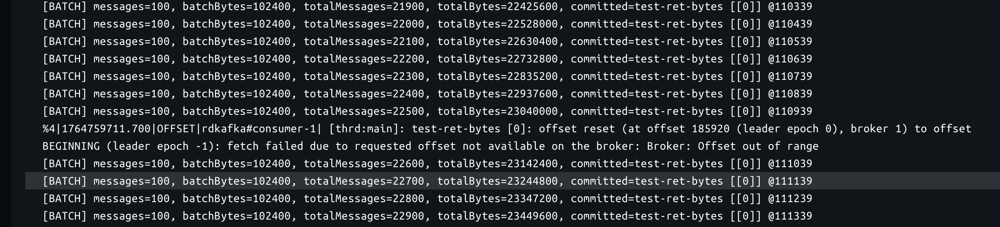

# Тест Kafka Retention / Offset Out-of-Range

## 1. Назначение теста

Этот стенд воспроизводит ситуацию, когда Kafka удаляет старые сегменты из-за очень маленького `retention`, а медленный consumer продолжает читать старые оффсеты.  
Цель теста — получить ошибки вида:

```
OFFSET|... Broker: Offset out of range
```

Это означает, что consumer запросил оффсет, который уже был удалён брокером.

---

## 2. Последовательность запуска

### Шаг 1 — Запуск контейнеров Kafka и медленного consumer

```
./start-containers.sh
```

Скрипт:

- останавливает предыдущие контейнеры,
- удаляет volumes Kafka,
- пересобирает consumer,
- запускает Kafka,
- создаёт тестовый топик `test-ret-bytes`,
- запускает consumer в профиле `slow-consumer`.

Consumer читает медленно, что создаёт условия для удаления старых сегментов.

---

### Шаг 2 — Запуск тестового сценария

```
./execute-test.sh
```

Скрипт выполняет следующие шаги:

- записывает 10 МБ данных,
- consumer начинает их читать пачками по 100 КБ раз в секунду,
- скрипт ждёт 15 секунд и перезапускает consumer, чтобы сбросить внутренний кеш librdkafka,
- записывает 1 МБ данных, чтобы consumer снова начал читать новые сообщения,
- ждёт ошибки `Offset out of range`.

---

## 3. Где смотреть логи

### Логи consumer

```
docker compose --profile slow-consumer logs -f consumer
```

### Логи Kafka

```
docker compose logs -f kafka
```

---

## 4. Настройки consumer

Consumer управляется через переменные окружения в `docker-compose.yaml`:

- `BOOTSTRAP_SERVERS` — адрес брокера,
- `KAFKA_TOPIC` — имя топика,
- `KAFKA_GROUP_ID` — consumer group,
- `BATCH_SIZE` — размер батча,
- `SLEEP_MS` — задержка между батчами.

Эти параметры позволяют легко регулировать скорость потребления и условия теста.

---

## 6. Цель теста

Если всё работает корректно, в логах consumer должны появиться строки:

```
Broker: Offset out of range
```



Это означает, что Kafka удалила сегменты быстрее, чем consumer успел их прочитать — ожидаемое поведение для проверки механизма retention.
